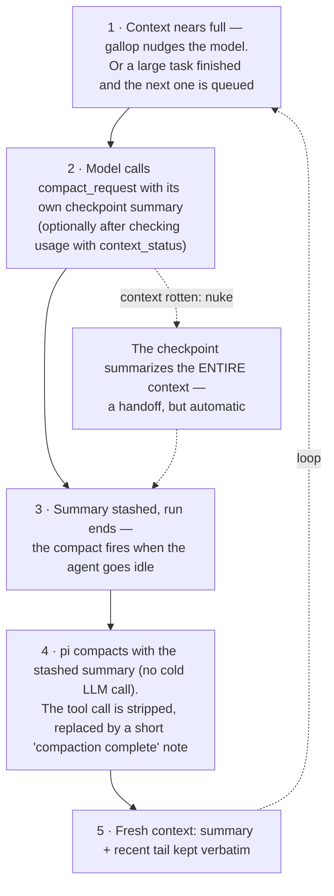

# Gallop

Keeps the agent moving. Prevents stalls and manages context lifecycle.

The headline feature is model-driven self-compaction: the model writes its
own checkpoint and compacts in-session, so the summarization rides the
session's cached prompt prefix instead of a cold prefill. It runs as a loop —
every fresh context starts the cycle again.

Everything else keeps the run alive and the context clean:

- **Stall detection** — resumes a model that halts mid-thought or mid-tool-call, escalating to a strategy nudge instead of resuming forever
- **Failure-loop, repetitive-call & mismatch detection** — spots stuck command patterns, then a circuit breaker halts the agent
- **Read guard** — blocks binary files (PDFs, archives, binaries, ...) before they garble the context, with a result-sniffing safety net
- **Binary output filter** — replaces binary bash output with a readable summary
- **Repetitive output collapse** — huge text output dominated by repeated line shapes (grep over a build tree, repeated error walls) is collapsed to examples + a count

## Features

### Self-Compaction (cache-friendly)

The LLM can request compaction via the `compact_request` tool and write the
checkpoint summary itself — the summarization happens inside the live session
(a normal turn), so that LLM call rides the session's cached prompt prefix with
no cold prefill. Gallop stashes the summary and returns it as a custom
`CompactionResult` in `session_before_compact` (with pi's file-list sections
appended), so pi skips its one-shot summarizer (which cold-prefills the
flattened conversation). A too-short summary never reaches that path —
`compact_request` fails the tool call and the model rewrites the checkpoint
and re-calls (same pattern as the minimum-context guard). If no summary is
stashed at all (native `/compact`, auto threshold, overflow recovery) or the
user aborts, gallop returns `undefined` and pi's native one-shot runs.

Tool arguments:

- `summary` — the checkpoint summary in pi's format (Goal / Constraints & Preferences /
  Progress / Key Decisions / Next Steps / Critical Context); the model focuses on
  older work, since the recent tokens up to the keep window
  (`compactKeepRecentTokens`, default ~8k) are kept verbatim — the tool description
  names the configured value. Stays in the kept tail as the tool call's arguments —
  one copy, the price of in-session summarization.
- `nuke` (boolean, optional) — summarize the *entire* context instead of keeping
  the most recent `compactKeepRecentTokens` (default ~8k) verbatim; only the
  last turn's tail survives. For contexts broken beyond repair (repeated failing
  tool calls), where the default tail is exactly the broken part. The cut point is
  recomputed with budget 0 by the same `findCutPoint` walker pi's `prepareCompaction`
  uses (mirroring its previous-compaction boundary logic) and returned as a custom
  `firstKeptEntryId` — pi uses it verbatim. The checkpoint must then carry full
  state, since the verbatim tail no longer covers recent work.
- `continue` (boolean) — if `true`, a fixed generic steer
  (`[Gallop] Compact done — proceed as commanded.`) is injected after compaction;
  the checkpoint's Next Steps section tells the agent what to do next. Omitted/`false`
  = the agent stops and you take the next step. No custom resume text is ever written
  or re-sent.

Minimum context: the call **fails when the whole context fits in the keep
window** (`compactKeepRecentTokens`, default 8k) — there is nothing older
than the verbatim tail to summarize, and pi would fail the compact. The guard
checks pi's own `getContextUsage()` (the same last-usage-anchored estimate the
automatic threshold check uses) against the live extension setting before stashing
anything: a below-minimum call fails as the tool call itself (the thrown error
becomes the tool result the model sees, with the reason and a retry-once-larger
hint), and no deferred compact is armed. A `nuke` on such a session fails with an
explicit escape hatch instead: pi evaluates the cut with the *configured* keep
window — never 0 — and refuses to compact a small session at all, so the model is
told to persist the state to memory (or a handoff file) and have the user start a
new session. Unmeasurable usage (`tokens: null` in the window right after a
compaction) proceeds and lets pi decide.

The tool description also suggests compacting at task boundaries: when a planned
task finished and another is queued, the checkpoint becomes the handoff for the
next task (which starts on a fresh context) instead of the next task inheriting
the previous one's tool-call history.

The compact itself is **deferred to pi's `agent_settled` event** (emitted after
the post-run loop). `ctx.compact()` first awaits the agent to go idle, which
only happens *after* pi's automatic threshold compaction ran — so firing it
inside the tool's `execute` at the moment a run's final usage crossed that
threshold would always double-compact: the automatic compact consumes the
stashed checkpoint first, then the manual one throws "Already compacted" and
the TUI shows an error. Deferring makes the race a no-op — if the automatic
compact (or a user `/compact`) ran first, `session_compact` clears the pending
state and the deferred trigger skips (a second check that the branch does not
already end in a compaction entry); in that race case the `continue` steer is
sent from `session_compact` instead of the manual `onComplete`.

Once the checkpoint has become the compaction summary, a `context` handler
replaces the `compact_request` exchange in every LLM request — the exchange
would otherwise duplicate the ~1k-token summary in the kept tail *and* read
as an unfulfilled request (the resumed model re-requested compaction, with
the triggering pressure nudge still standing in the tail). When the summary
text is verifiably carried by a `compactionSummary` message in context, the
assistant message carrying the call is rewritten to a fixed completion marker
(“Compaction complete — the summary at the top of context is your current
state. Do not call compact_request again unless context pressure returns.”)
and the paired toolResult is dropped. A call whose text is NOT carried
(native-fallback compact) keeps its call as a true record and only gets its
in-progress “Compacting.” result text marked done. Pre-compact tree views
and aborted compacts (no `compactionSummary` in context) are left intact, so
a re-request after an aborted compact is still the correct recovery. The
session file and TUI transcript always retain the full summary; the rewrite
is deterministic, so the prefix stays cache-stable.

`message_end` triggers nothing (pi emits it *before* pending tools execute) —
every compact request resolves deterministically at `agent_settled`. A
re-entrancy guard skips re-triggered `ctx.compact()` calls while a compact is
in flight (pi would throw "Already compacted"), re-armed at each new user
turn.

`/qcompact` (v2.0.0–v2.0.2) is gone: the context-pressure nudge below asks the
model to compact itself as the context fills, and pi's native `/compact`
remains for an immediate user-initiated compact (cold one-shot — the trade for
not needing a live-model checkpoint turn).

#### Keep window (`compactKeepRecentTokens`)

The keep window — how many recent tokens survive verbatim — is an extension
setting in the `gallop` namespace of settings-ext.json, default **8000**. The
smaller default is the design point: the model-written checkpoint plus the
post-compaction evidence package below carry what a 20k verbatim tail would,
so self-compact runs a tighter tail. It applies to self-compaction only — the
cut override is only reachable with a stashed checkpoint, and native compacts
(`/compact`, the auto threshold without a stash, overflow recovery) keep pi's
own `compaction.keepRecentTokens` (default 20k) untouched. Mechanically:
whenever the extension window differs from pi's configured window (or `nuke`),
the cut point is recomputed with pi's own `findCutPoint` walker and returned
as a custom `firstKeptEntryId`, which pi honors verbatim; equal windows → pi's
cut as-is; no branch entries in the event → pi's cut as-is (fail-open). Rolling
back to the stock tail is one setting flip (20000) — pi's settings.json is
never touched.

#### Post-compaction evidence blocks

The checkpoint summary is a lossy rewrite; two deterministic blocks close the
fidelity gap after each self-compaction. They are delivered as invisible custom
messages (`display: false`, no turn triggered) 200 ms after `session_compact` —
in context before the continue steer starts the next turn — and are
regenerated per compaction (the keep window carries them only while inside it,
so they self-clean):

- **Protected user messages** — the user messages covered by the compaction,
  verbatim (synthetic `[Gallop]`/`[Memory]` messages and recall-hint suffixes
  stripped, newest-first within a 16k-char budget, omissions labeled). The
  user's instructions never survive only as summary paraphrase.
- **Evidence index** — `L<line>` pointers into the session JSONL for the
  covered span's high-value tool output: errors from any tool first, then
  successful read/edit/write/bash grouped by (tool, full command),
  config/schema/test targets first, per group newest + oldest, the rest by
  recency (8k-char budget). Each row: `L<n> tool target [ERR] :: head…tail` —
  fetch the full payload with `session_recall`, line = the number after L.

The build is fail-open: any error (no covered range, unreadable session file)
degrades to protected-only or no blocks — the blocks are a fidelity aid and
never block the compaction. A native compact (no stashed checkpoint) delivers
none.

### Read Guard (binary file blocking)

Intercepts `read` tool calls targeting known binary file types (`.pdf`, `.docx`, `.xlsx`, `.pptx`, archives, databases, compiled binaries, media, CAD files, etc.) and blocks them before execution. The read tool has no binary detection — it would dump raw bytes as garbled UTF-8 text into context. The block message includes a remediation hint pointing at the right tool or skill (e.g. the pdf skill for `.pdf`).

- Image formats the read tool handles natively (jpg/png/gif/webp/bmp) are **not** blocked
- Unsupported image formats (tiff, heic, ...) are deliberately **not** blocked either — pi may add native support without notice, and the safety net below catches them until then
- ASCII-capable CAD formats (`.stl`, `.obj`, `.step`, `.iges`, `.dxf`) are **not** blocked — they are often plain text the read tool handles fine; binary variants (e.g. binary STL) are caught by the safety net. Always-binary `.dwg` and `.3mf` remain blocked
- Safety net: `read` tool **results** are also sniffed for binary content (null bytes, >5% non-printable, >5% U+FFFD replacement characters) and replaced with a suppression summary — catches misnamed or extension-less binaries and unsupported image formats
- Toggle with `/gallop-read-guard [on|off]` (persisted, default on; stored in the `gallop` namespace of `~/.pi/agent/settings-ext.json` — pi's own `settings.json` is left untouched)

### Binary Output Filter

Intercepts bash tool results before they enter context. Detects binary output (null bytes, >5% non-printable characters, >5% U+FFFD replacement characters from undecodable bytes) and replaces it with a summary message. Prevents context corruption from accidental `head`, `cat`, or other commands on binary files.

The summary includes:
- Byte count and detection reason
- Hex head preview (first 64 bytes)
- **First 3 and last 5 readable lines** (control chars stripped) so you can verify the command ran correctly
- Total line count when output exceeds 8 readable lines
- Toggle with `/gallop-binary [on|off]` (persisted, default on, in the same `~/.pi/agent/settings-ext.json` namespace)

### Repetitive Output Collapse

The binary filter catches garbled bytes; this catches the other context-killer — huge *text* output where a small number of line shapes repeat: grep/find over a build tree (thousands of `file:line: MATCH` lines sharing the matched string), repeated error walls. Pi's truncation still injects ~12k tokens of near-duplicates at that size, and in the field that has wrecked sessions outright (the model stops responding).

Only the disaster band is touched (≥ 80 lines AND ≥ 30KB), and only two conservative shapes trigger it:

- **Exact-line repetition** — the top literal lines cover ≥ 50% of all lines (identical content carries no per-line information)
- **Long shared region** — most lines share a common region of ≥ ~32 chars (detected via frequent 16-char shingles co-occurring ≥ 16 chars apart in one line). This is what keeps output with a short shared label (timestamp prefix, `npm WARN`) and a unique payload intact — the per-line information is what you came for

On a hit the result becomes head/tail examples + a count + a re-run hint; pi's truncation footer (full-output temp path) is preserved verbatim when present, so the model can still drill in via bash. A final shrink guard (collapse that saves < 50% of the bytes) passes the output through untouched. Binary suppression keeps precedence; the two layers have independent toggles.

- Toggle with `/gallop-collapse [on|off]` (persisted, default on, in the same `~/.pi/agent/settings-ext.json` namespace)

### Stall Detection

Monitors assistant messages for unexpected stops. When the LLM halts mid-thought or mid-tool-call (not a clean `tool_use` handoff), sends a resume prompt.

- Triggers on: `message_end` where last content is `thinking` or `tool_use`
- Skips: `aborted`, `error`, and normal `tool_use` stops (a normal tool handoff **resets** the stall streak)
- Resume messages throttled to one per 10s to avoid spam, but **every** stall counts toward escalation — a fast stuck loop escalates instead of resuming forever
- Sends `[Gallop] Resume: <reason> (stopReason: <value>)` as steer message

#### Stall Escalation

Consecutive stalls escalate to prevent infinite resume loops:

| Stalls | Action |
|--------|--------|
| 1–3 | Normal resume message |
| 4+ | Stronger resume with stall count warning |
| 5+ | **Stop** auto-resume; notify user to try `/new` or `/compact` |

Stall counter resets on any non-stall assistant message (a final text answer or a normal tool-use handoff).

### Failure-Loop Detection

Tracks bash commands that fail repeatedly with the same error. When a command fails ≥3 times within a 5-turn window with the same error fingerprint, injects a nudge with contextual hints.

- Normalizes commands (whitespace, case) for fuzzy matching
- Fingerprints errors by last meaningful line
- Provides hints for common patterns: ENOENT, permission denied, package managers, syntax errors
- Sends `[Gallop] Failure loop detected: 
` as steer message

#### Failure-Loop Escalation

Repeated failures escalate from suggestion to hard block. If a nudge is ignored (same command fails again), it escalates immediately:

| Failures | Level | Action |
|----------|-------|--------|
| 3 | **Nudge** | Suggest changing strategy with contextual hints |
| 4 | **Nudge+** | Stronger warning that previous nudge was ignored |
| 5+ | **Block** | Hard-block further retries via `tool_call` interceptor; LLM must use a different command |

Successful command execution resets all failure-loop state.

### Repetitive-Call Detection

Tracks consecutive tool calls with identical arguments across **all tools**. When the same tool+args repeats ≥3 times in a row, injects a nudge to break the loop.

- `read` — fingerprints by file path + offset/limit; hints to analyze content already in context
- `bash` — fingerprints by normalized command; hints to use output or move on
- Other tools — fingerprints by sorted JSON of args
- Resets counter on any different call
- Skips bash errors (failure-loop handler already covers them)
- Sends `[Gallop] Repetitive action detected: 
` as steer message

#### Repetitive-Call Escalation

If a nudge is ignored (same call repeats again), it escalates immediately:

| Calls | Level | Action |
|-------|-------|--------|
| 3 | **Nudge** | Suggest analyzing existing output or moving on |
| 4 | **Nudge+** | Stronger warning to stop repeating |
| 5+ | **Block** | Hard-block identical calls via `tool_call` interceptor |

A successful call with different arguments clears the escalation state, so a later legitimate re-use of the same call (e.g. `npm run build` after editing files) starts fresh instead of being hard-blocked from an earlier streak.

### Circuit Breaker

A global circuit breaker prevents total doom loops when multiple patterns are blocked:

- Tracks total blocks enforced across all detectors
- After **3 total blocks**, Gallop **pauses the agent** with a dialog:
  - **Continue** — clears all blocks, lets the agent try again
  - **Stop** — blocks all tool calls, halts the agent, returns to your prompt
- After Stop, you're in control: type a new message, or use `/new` / `/compact` / change model

### Reasoning-Action Mismatch

Detects when the LLM acknowledges an error in its thinking but then calls the same tool that just failed. Catches the gap between what the model says and what it does.

- After any tool call fails, records the fingerprint (tool + args + error)
- On the next `tool_call`, checks if the thinking block contains error keywords ("wrong", "failed", "retry", "different", "instead", etc.)
- If thinking acknowledges an error AND the tool call matches the last failed fingerprint → injects `[Gallop] Mismatch: ...` steer message
- One-shot: clears after firing or on any successful tool call
- Operates independently of failure-loop and repetitive-call escalation

### Context-pressure nudge

As the context runs low, gallop steers the live model to self-compact:
one advisory steer per compaction cycle (state resets on `session_compact`),
at the configured threshold — `reserveTokens + the nudge buffer` (default
2k → ~18k remaining) when auto-compact is on, or the no-backstop threshold
(default 16384 = pi's default reserve) when it is off (then no backstop
exists, and an overflow would abort the run) — **floored by 25% of the
model's context window** (default). 16384 is exactly 25% of a 64k window, so
small windows stay on the configured value (zero behavior change) while the
margin scales up on large ones. The floor matters there: a fixed token count
is a late nudge — one big tool result or a batched read turn can burn 16k+
tokens, so on a 114k+ window the context runs out before the model reaches a
pause point to compact. The threshold reads pi's compaction settings from the
global + project `settings.json` (merged per key, project wins — same
read-only reader shape as the context extension, falling back to pi's
defaults), so it tracks a custom `reserveTokens`.

The thresholds are exposed settings in the `gallop` namespace of
`~/.pi/agent/settings-ext.json` (loaded on `session_start`; a changed value
takes effect on the next /reload or new session): `compactNudgeBuffer`
(tokens, default 2048) — the warning margin above the backstop; widen it to
compact earlier with more headroom, set it to 0 to let the backstop decide —
`compactNudgeDisabledAt` (tokens, default 16384) — the nudge threshold when
auto-compact is off (no backstop to anchor a buffer to) — and
`compactNudgePct` (fraction 0–1, default 0.25) — the window floor on both
bases; set it to 0 for the fixed-only behavior.
`context_status`'s threshold line and advice tiers track all three automatically. After the nudge, silence —
pi's automatic compaction (which also drives overflow recovery, so it stays
enabled as the backstop) decides. No nudge while a compact is pending or in
flight — including an en-route one whose `compact_request` call sits in the
very message being judged (pi emits `message_end` before that call executes, so
the state flags are not set yet — the message content is the signal) — when a
message ends in aborted/error, or when the circuit breaker has halted the
agent.

Compaction resets all escalation state (blocks, nudges, stall count).

### Context status (active usage query)

The model has no passive view of context usage — the nudge above only fires
near the limit. `context_status` is a parameterless tool that reports, on
demand: current usage vs the model window (percent), remaining tokens, the
two backstop thresholds (gallop nudge, pi auto-compact — or the missing
backstop when auto-compact is off), and one deterministic advice line
(headroom OK / pressure building / near the backstop). It reads pi's own
`getContextUsage()` — the same last-usage-anchored estimate pi's automatic
threshold check uses — so the numbers match the backstop. In the window right
after a compaction (before the next assistant response carries usage) pi
reports `null`; the tool then says the context is fresh and safe to proceed.

The tool description scopes the call frequency — task boundaries and large
batches of reads or images (~1.6k tokens each), not after every tool call — so
the on-demand query stays on-demand (each result stays in the kept context).
Per-category visualization for humans remains the separate `/context`
extension.

